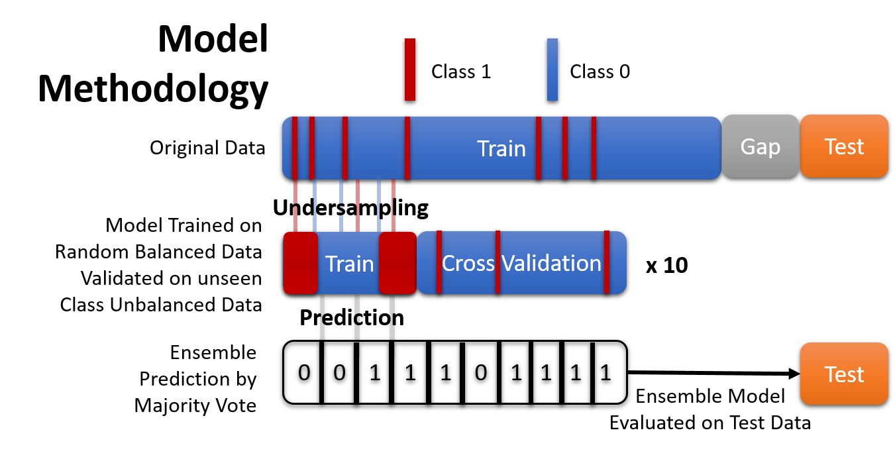
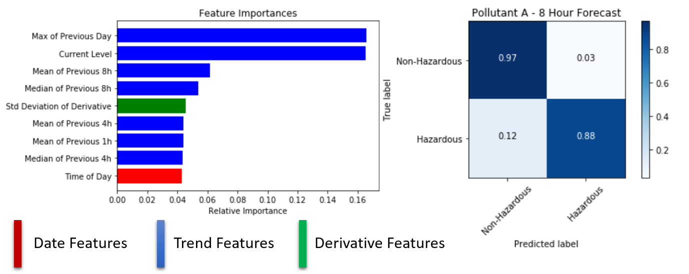
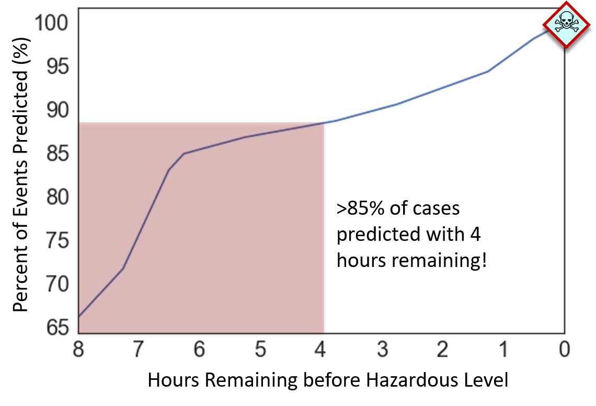

# Breathe Free

---
## Contents

[**1. Indoor Air Quality**](#indoor_air)

[**2. Challenges for Traditional Time Series Forecasting**](#stats_challenges)

[**3. Turning Time Series Forecasting into Classification**](#classification_setup)

[**3. Feature Engineering**](#feat_engineering)

[**4. Modeling with Unbalanced Data**](#model_skew)

[**5. Model Metrics that Matter**](#scoring)

[**6. Summary and Future Directions**](#future)

[**7. About Me**](#about_me)

# <a name="indoor_air">Indoor Air Quality</a>

It's a common misconception that the most polluted air is the smog outside. Inadequate ventilation, chemically-treated building materials, and high traffic areas can commonly cause the air inside a home or office can be up to 5 times more polluted than outdoors. 

As part of [Insight Data Science](insightdatascience.com), I completed a data science consulting project for an indoor air quality sensor company. Their product tracks five pollutants and alerts occupants when a pollutant has reached hazardous levels. 

However, currently their product could only alert occupants **after the air had become hazardous**. The goal of the project was to design a forecasting model so the company could provide users with an 8-hour warning, giving them ample time to ventilate the area **before it's too late.**

# <a name="stats_challenges">Challenges for Traditional Time Series Forecasting</a>

Historical pollutant data, user data, and location data was accessed from the company's database through Google BigQuery. As a test case, data was taken from 400 users in a major metropolitan city. The sensor records an average reading of the previous 15 minutes, and historical data goes back up to 2 years for each location. Looking at a weeks worth of data for 4 separate locations below, it's clear that predicting if **Pollutant A** is going to reach a hazardous level (seen in red) will be very challenging for traditional statistical time series models. 

Most time series forecasting rely on the assumption that the time series is **stationary**, meaning that the mean, standard deviation, and autocorrelation (correlation to previous time points) are constant for some period of time. I could go through the trouble to de-season and de-trend the data for each location to achieve stationarity, but I would quickly hit another roadblock when training my model.

A traditional time series model is a regression model, and the parameters of a statistical model (ARIMA, ARMAX, etc.) are fit on the basis of minimizing a cost function (such as least squares) and this minimization is not guaranteed to optimize the results of a classification problem, i.e. correcting predicting when the time series will enter the hazardous zone in the next 8 hours.

Lastly, a large multi step forecast is required, which compounds the errors and difficult. The resolution of this data is 15 minutes and I need to predict if **any** future 15 minute interval within the next 8 hours hits an unsafe range, so the data cannot be smoothed into a one-step forecasting problem. 

# <a name="classification_setup">Turning Time Series Forecasting into Classification</a>

So what's a better alternative for this problem? At it's core, the accumulation of pollution in an indoor environment comes from, well, us. Even on a pristine environment like the [International Space Station](https://science.nasa.gov/science-news/science-at-nasa/2000/ast13nov_1), many toxins are emitted from the astronauts themselves and complex filtration systems are needed keep the air breathable. 

As this same concept applies on Earth, I know that the presence and activity of people at each location causes pollutants to rise. These human behaviors are likely **repetitive** for each location, with a large amount of non-periodic delay inbetween. These behaviors are also likely to be **generalizable**, and the sensor response for each behavior is likely to match other location that have similar ventilation, building materials, and human traffic. 

With these assumptions, I engineered features to represent previous location-specific behavior **and** similar behavior between locations to transform this problem into a binary classification problem where each 15 minute time point was labeled as: 

| Class        | Condition           |
|------|------|
|Class 1 | Location will be above the hazardous level at any time in the next 8 hours|
|Class 0 | Location will be below the hazardous level for the next 8 hours|

# <a name="feat_engineering">Feature Engineering</a>

Five main types of features were fed to a Gradient Boosted Classifier:
1. **Date and Time:** Day of the week and time of day to capture differences between weekday and weekend schedules.
2. **General Trend:** Rolling Mean, Median, Max, and Standard Deviation of **Pollutant A** for the past 1hr, 4 hrs, 8 hrs to capture general trends of a location and previous behavior. 
3. **Rate of Change Trend:**  Rolling Mean, Median, Standard Deviation, Skew, and Kurtosis for the rate of change for **Pollutant A** to capture a characteristic sensor response of similiar behaviors between different locations.
4. **Outdoor Weather:** Daily Humidity, Temperature, Precipitation, and Dew Point data scraped from [Weather Underground](https://www.wunderground.com) using a package called [Beautiful Soup](https://pypi.python.org/pypi/beautifulsoup4) to capture seasonal effects.
5. **Pollutant Level:** Current Level of **Pollutant A** to factor in the distance to the hazardous level.

Some features have high correlation (particularly any Rolling Mean and Median), but it's very useful to include both as sensor data can be suspectible to noise that will greatly influence the mean versus the median, and traditional tree based models still learn very well in the presence of highly correlated features. 

# <a name="model_skew">Modeling with Unbalanced Data</a>
The last challenge I needed to tackle before training my model is the class imbalance in the data. Thankfully, only ~10% of events exceed the hazardous level (Class 1). However, this makes model training more difficult, as the feature differences between Class 0 and Class 1 (**the signal**) can frequently get lost by the abundance of the majority Class (**the noise**). 

Removing many samples of the majority class (**undersampling**) to balance the amount of Class 1 and 0 in the training data can be used to help an algorithm learn the distinct difference between the classes. Training a model on balanced data tends to greatly lower the amount of false negatives (missing a forecasted dangerous event) but will also tend to raise the amount of false positives (forecasting a dangerous event when there isn't one) as the model has been trained on an abnormally high percentage of Class 1 data. 

To selectively lower the false positive rate, I trained 10 separate models on randomized sections of the training data, recorded the predictions of each model, and then took a majority vote. A more in-depth demo of this methodology can be found [here](https://www.kaggle.com/mangarella/ensemble-modeling-with-skewed-datasets). 

# <a name="scoring">Model Metrics that Matter</a>

The above approach gave great results. The confusion matrix below shows the model is correctly selecting most of the future hazardous events (with 88% recall) and after ensembling to lower the false positive rate, it's doing a good job of only identifying the events will become hazardous (71% precision). 

From the top feature importances, I can see that much of the success is coming from features that correspond to repeated patterns of a location, with some contribution from derivative features that correspond to similar behavior between users, and some date features. 

But before I check this off as a success, the model needs much more further validation. One glaring concern is this is **sequential data**, and it's been evaluated on **non-sequential** evaluation metrics. What matters most for this use-case is the time a user has to react to a toxic event, so I wrote a custom evaluation function to record the model lag - the time between when the 8-hour window starts, and when the model predicts an event will occur within the next 8 hours.

For each user the function:
- Scans for when an 8 hour window starts (the true class changes from 0 to 1).
- Measures the time it takes the model to make a prediction (the predicted class changes from 0 to 1)
- Repeats the process when the window ends (the true class shifts back from 1 to 0) and a new window starts (the true class changes again from 0 to 1)

I have plotted the percentage of events predicted versus time remaining. I can see that the model is still holding up well, with **>60% of events predicted** the second the 8 hour forecast starts and **_>85% of events predicted_** with 4 hours remaining. 

# <a name="future">Summary and Future Directions</a>
In summary, I've developed a model that can effectively forecast when the indoor air will become hazardous up to 8 hours beforehand. This effectively turns a stressful alert into an actionable forecast, allowing users to efficiently manage their indoor air quality.  

This development spanned three weeks at Insight, and many other features could be integrated to further improve the model. Some things I've tooled around with, but didn't make the final cut, are:

1. **Location Data** - There are some snippets of code that add in location data for each location. When locations are relatively nearby to each other, i.e. the same city, their latitude and longitude can be approximated to x and y coordinates, ignoring the curvative of the Earth (more info [here](https://stackoverflow.com/questions/16266809/convert-from-latitude-longitude-to-x-y)). I was very interested in addin a feature that would compare locations to their 5 or 6 closest neighbors. The first part, determining those neighbors, is relatively easy and can be searched quickly using a [KDTree](https://docs.scipy.org/doc/scipy/reference/generated/scipy.spatial.KDTree.html). The second part, computing the covariance between a location and the rolling mean of its five closest neighbors becomes a bit trickier. A majority of locations will have a unique set of five closest neighbors, and each set would have to be quered, computed, and then stored.

# <a name="about_me">About Me</a>

My name is Michael Mangarella (Mike). I'm a chemical engineer and a data scientist. I received my PhD in Chemical and Biomolecular Engineering from Georgia Tech in 2015, and spent the last year running a startup to turn gas filtration technology from my dissertation into viable military grade gas filters. My passion for data science comes from a minor in quantitative finance, and a couple years developing retail options trading strategies. I joined Insight in Fall 2017.  
