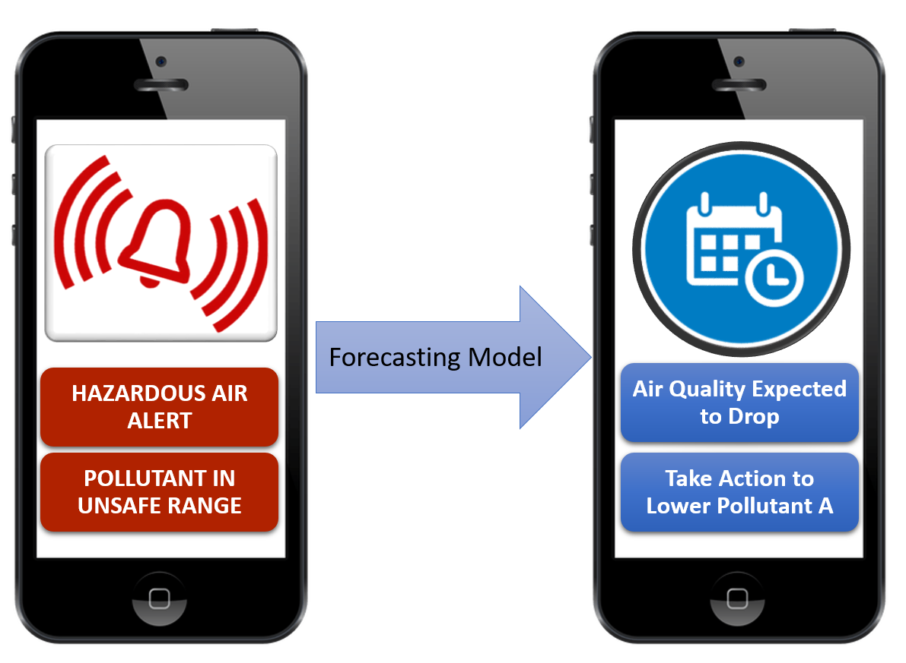
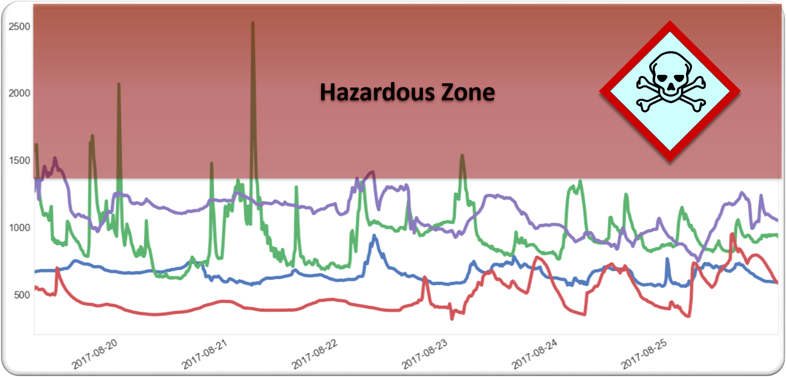
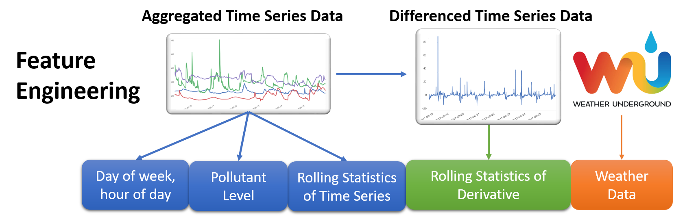

# Breathe Free

---
## Contents

[**1. Indoor Air Quality**](#indoor_air)

[**2. Challenges for Traditional Time Series Forecasting**](#stats_challenges)

[**3. Turning Time Series Forecasting into Generalized Classification**](#classification_setup)

[**3. Feature Engineering**](#feat_engineering)

[**4. The Model and Dealing with Skewed Data Sets**](#model_skew)

[**5. Model Metrics that Matter**](#scoring)

[**6. Summary and Future Directions**](#future)

[**7. About Me**](#about_me)

# <a name="indoor_air">Indoor Air Quality</a>

It's a common misconception that the most polluted air is the smog outside. Inadequate ventilation, chemically-treated building materials, and high traffic areas can commonly cause the air inside a home or office can be up to 5 times more polluted than outdoors. 

As part of Insight Data Science, I completed a data science consulting project for an indoor air quality sensor company. Their product tracks five pollutants in indoor environments and alerts occupants when a pollutant had reached hazardous levels. 

However, currently they can only alert occupants **after the air has become hazardous**. The company wanted to provide their users' with an 8-hour warning, so there was amble time to take measures and ventilate the indoor area **before it's too late.** The goal of the project was to design a forecasting to predict when a pollutant would occur, so they could alert the user and allow them to take action.

# <a name="stats_challenges">Challenges for Traditional Time Series Forecasting</a>

Historical pollutant data, user data, and location data was accessed from the company's database through Google BigQuery. As a test case, data was taken from 400 users in a major metropolitan city. The sensor records an average reading of the previous 15 minutes, and historical data goes back up to 2 years for each location. Looking at a weeks worth of data for 4 separate locations below, we can see that predicting if **Pollutant A** is going to reach a hazardous level (seen in red) will be very challenging for traditional statistical time series forecasting models. 

Most time series forecasting relies on the assumption that the time series is stationary, meaning that the mean, standard deviation, and autocorrelation (correlation to previous time points) are constant for some period of time. I could go through the trouble to de-season and de-trend the data for each location to achieve stationarity, but I would quickly hit another roadblock when training my model.

A traditional time series model is a regression model, and the parameters of a statistical model (ARIMA, ARMAX, etc.) are fit on the basis of minimizing a cost function (such as least squares) and this minimization is not guaranteed to optimize the results of a classification problem, i.e. correcting predicting when the time series will enter the hazardous zone in the next 8 hours.

Lastly, a large multi step forecast is required. The resolution of this data is 15 minutes and I need to predict if **any** future 15 minute interval within the next 8 hours hits an unsafe range, so the data cannot be smoothed into a one-step forecasting problem. 

# <a name="classification_setup">Turning Time Series Forecasting into Generalized Classification</a>

So what's a better alternative for this problem? At it's core, the accumulation of pollution in an indoor environment comes from, well, us. Even on a pristine environment like the [International Space Station](https://science.nasa.gov/science-news/science-at-nasa/2000/ast13nov_1), many toxins are emitted from the astronauts themselves and complex filtration systems are needed keep the air breathable. 

Assuming this same concept applies on earth, I know that the behavior of people at each location causes pollutants to rise. If three people walk into a room and start kicking up dust from the carpet, this behavior is represented characteristic pattern in the sensor data.

These human behaviors are likely **repetitive** for each location, with a large amount of non-periodic delay inbetween. These behaviors are also likely to be **generalizable**, and the sensor response for each behavior is likely to match other location that have similar ventilation, building materials, and human traffic. 

With these assumptions, I engineered features to represent previous location-specific behavior **and** similar behavior between locations to transform this problem into a binary classification problem where each 15 minute time point was labeled as: 

| Class        | Condition           |
|------|------|
|Class 1 | Location will be above the hazardous level at any time in the next 8 hours|
|Class 0 | Location will remain below the hazardous level for the next 8 hours|

# <a name="feat_engineering">Feature Engineering</a>

Five main types of features were fed to a Gradient Boosted Classifier:
1. **Date and Time:** Day of week, time of day to capture differences between weekday and weekend schedules.
2. **General Trend:** Rolling Mean, Median, Max, and Standard Deviation of **Pollutant A** for the past 1hr, 4 hrs, 8 hrs to capture general trends of a location and previous behavior. 
3. **Rate of Change Trend:**  Rolling Mean, Median, Standard Deviation, Skew, and Kurtosis for the rate of change for **Pollutant A** to capture a characteristic sensor response of similiar behaviors between different locations.
4. **Outdoor Weather:** Daily Humidity, Temperature, Precipitation, and Dew Point data scraped from [Weather Underground](https://www.wunderground.com) using ['Beautiful Soup'](https://pypi.python.org/pypi/beautifulsoup4) to capture seasonal effects.
5. **Pollutant Level:** Current Level of **Pollutant A** to factor in the distance to the hazardous level.

Some features have high correlation (particularly any Rolling Mean and Median), but it's very useful to include both as sensor data can be suspectible to noise that will greatly influence the mean versus the median, and traditional tree based models still learn very well in the presence of highly correlated features. 

# <a name="model_skew">Model Metrics that Matter</a>

# <a name="scoring">Custom Scoring Metrics</a>

# <a name="future">Summary and Future Directions</a>

# <a name="about_me">About Me</a>

My name is Michael Mangarella (Mike). I'm a chemical engineer and a data scientist. I received my PhD in Chemical and Biomolecular Engineering from Georgia Tech in 2015, and spent the last year running a startup to turn gas filtration technology from my dissertation into viable military grade gas filters. Most of my passion for data science comes from my minor in quantitative finance, and a couple years developing retail options trading strategies. I joined Insight in Fall 2017 to continue my technical development. 
