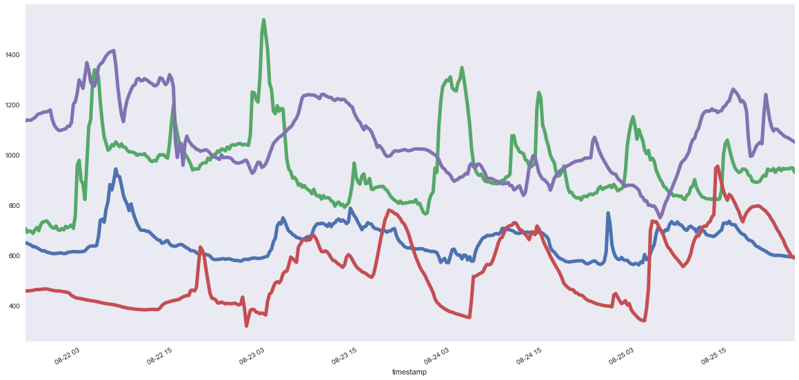

# Breathe Free

## Introduction

It's a common misconception that the most polluted air is the smog outside. Inadequate ventilation, chemically-treated building materials, and high traffic areas can commonly cause the air inside a home or office can be up to 5 times more polluted than outdoors. 

As part of Insight Data Science, I completed a data science consulting project for an indoor air quality sensor company. Their product tracks five pollutants in indoor environments and alerts occupants when a pollutant had reached hazardous levels. 

However, currently they can only alert occupants **after the air has become hazardous**. They wanted to provide their users' with an 8-hour warning, so there was amble time to take measures and ventilate the indoor area **before it's too late.** The goal of the project was to design a forecasting to predict when a pollutant would occur, so they could alert the user and allow them to take action.

## The Data and Challenges for Traditional Time Series Forecasting

Historical pollutant data, user data, and location data was accessed from the company's database through Google BigQuery. As a test case, data was taken from 400 users in a major metropolitan city. The sensor records an average reading of the previous 15 minutes, and historical data goes back up to 2 years for each location. Looking at a weeks worth of data for 4 separate locations below, we can see that predicting if **Pollutant A** is going to cross into the danger zone (seen in red) is going to be very challenging for traditional statistical time series forecasting models. 

Most time series forecasting relies on the assumption that the time series is stationary, meaning that the mean, standard deviation, and autocorrelation (correlation to previous time points) are constant for some periodic measure of time. I could go through the trouble to de-season and de-trend the data for each location into a stationary time series, but I would quickly hit another roadblock:

Insert time series forecast image here

A traditional time series model is a regression model, and the parameters of a statistical model (ARIMA, ARMAX, etc.) are fit on the basis of minimizing a cost function (such as least squares) and this minimization is not guaranteed to optimize for a classification problem, where the metric is correct binary classification of whenever the time series is going to cross the danger zone within the next 8 hours.

Lastly, A large multi step forecast is required. The resolution of this data is 15 minutes and I need to predict if **any** future 15 minute interval within the next 8 hours hits an unsafe range, so the data cannot be smoothed into a one-step forecasting problem. 

## Turning Time Series Forecasting into Generalized Classification

Now that we've stepped away from statistical regression models, what's a better alternative for this problem? At it's core, the accumulation of pollution in an indoor environment comes from, well, us. Even on a pristine environment like the [International Space Station](https://science.nasa.gov/science-news/science-at-nasa/2000/ast13nov_1), many toxins are emitted from the astronauts themselves and require complex filtration systems to keep the air safe. 

How does this knowledge translate to indoor environments on Earth? On a very high level, I can assume that the behavior of people at each location causes pollutants to rise. If three people walk into a room and start kicking up dust from the carpet, this behavior can be linked to some characteristic pattern in the sensor data. 

These behaviors are likely **repetitive**, with some randomness and non-periodic delay inbetween. These behaviors are also likely to **generalize**, and signal characteristics from some locations is likely going to match other rooms that have similar ventilation, building materials, and human traffic. With these assumptions, I engineered features to represent previous location-specific behavior **and** similar behavior between locations, applied them to each time point for each of the 400 locations, and then used a supervised learning algorithm where each time point that **crossed or remain above the hazardous level in the next 8 hours was labeled Class 1** and each time point that **remained below the hazardous level was labeled Class 0**.

## Feature Engineering

Five main types of features were fed to a Gradient Boosted Classifier:
- **Date and Time Features:** Day of week, time of day.
- **General Trend Features:** Rolling Mean, Median, Max, and Standard Deviation of **Pollutant A** for the past 1hr, 4 hrs, 8 hrs
- **Derivative Features:**  Rolling Mean, Median, Standard Deviation, Skew, and Kurtosis of the rate of change for **Pollutant A** for the past 2.5 hrs
- **Outdoor weather data:** Daily Humidity, Temperature, Precipitation, and Dew Point data scraped from [Weather Underground](https://www.wunderground.com)

These features were chosen to be a mix of features specific to each Some features have high correlation (particularly any Rolling Mean and Median), but it's very useful to include both as sensor data can be suspectible to noise that will greatly influence the mean versus the median. Traditional tree based models still learn very well in the presence of highly correlated features, and 

Other types of features that were initially fed to the model with little success were:

## 

## About Me

My name is Michael Mangarella (Mike). I'm a chemical engineer and data scientist. I received my PhD in Chemical and Biomolecular Engineering from Georgia Tech in 2015, and spent the last year running a startup to turn gas filtration technology from my dissertation into viable military grade gas filters. Most of my passion for data science comes from my minor in quantitative finance, and a couple years developing retail options trading strategies. I joined Insight in Fall 2017 to continue my technical development. 
